# Event Management App — Implementation Plan

## Table of Contents

1. [Project Overview](#project-overview)
2. [System Architecture & Modules](#system-architecture--modules)
3. [Module Flows & Diagrams](#module-flows--diagrams)
4. [Development Roadmap (4 Sprints)](#development-roadmap-4-sprints)
5. [Sprint 1 — MVP: Public Discovery, Auth & Registration](#sprint-1--mvp-public-discovery-auth--registration)
6. [Sprint 2 — Seating & Ticketing](#sprint-2--seating--ticketing)
7. [Sprint 3 — Check-In & Attendance](#sprint-3--check-in--attendance)
8. [Sprint 4 — Admin Management & Reporting](#sprint-4--admin-management--reporting)
9. [Cross-Cutting Concerns](#cross-cutting-concerns)
10. [Suggested Tech Stack](#suggested-tech-stack)
11. [Deliverables Summary](#deliverables-summary)

---

## Project Overview

The Event Management App is a modular platform for discovering events, registering attendees, managing seating, generating tickets, checking in guests, and administering events end-to-end. Splitting the system into discrete modules simplifies both design and development, allowing each sprint to deliver a working increment of value.

### Goals

- Allow **visitors** to browse and discover public events before logging in.
- Provide **authentication** so users can register for events and manage their profile.
- Give **authenticated users** a dashboard for events, tickets, and notifications.
- Support the full **registration lifecycle** including eligibility checks and waitlists.
- Enable **seating management** for venue-based events.
- Generate and deliver **digital tickets** (QR code, PDF, email).
- Provide **check-in tools** for event staff.
- Empower **organizers/admins** to create, publish, and manage events and registrations.
- Deliver **reports and analytics** for operational insight.

### User Roles

| Role | Description |
|------|-------------|
| **Visitor** | Unauthenticated user browsing public events |
| **Attendee** | Registered user who can register for events |
| **Event Staff** | Staff who scan tickets and mark attendance |
| **Organizer / Admin** | Creates events, manages registrations, views reports |

---

## System Architecture & Modules

The application is divided into **10 functional modules**, grouped into **4 development phases (sprints)**:

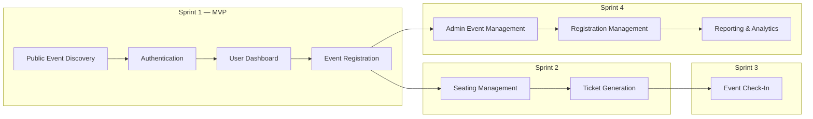

### Module Index

| # | Module | Phase | Key Screens / Features |
|---|--------|-------|------------------------|
| 1 | Public Event Discovery | Sprint 1 | Landing, Event Listing, Event Details |
| 2 | Authentication | Sprint 1 | Login, Registration, Forgot Password, Dashboard Entry |
| 3 | User Dashboard | Sprint 1 | Dashboard, Profile, My Events, Notifications |
| 4 | Event Registration | Sprint 1 | Registration, Eligibility, Waitlist |
| 5 | Seating Management | Sprint 2 | Venue Layout, Seat Map, Seat Selection |
| 6 | Ticket Generation | Sprint 2 | QR Code, PDF Ticket, Email Delivery |
| 7 | Event Check-In | Sprint 3 | QR Scanner, Attendance Tracking |
| 8 | Admin Event Management | Sprint 4 | Event Creation, Publishing, Updates |
| 9 | Registration Management | Sprint 4 | Approval, Attendee Management, Export |
| 10 | Reporting & Analytics | Sprint 4 | Registration, Attendance, Seat Occupancy, Event Analytics |

---

## Module Flows & Diagrams

### 1. Public Event Discovery Flow

**Audience:** Visitors (before login)

**Screens:** Landing Page · Event Listing · Event Details

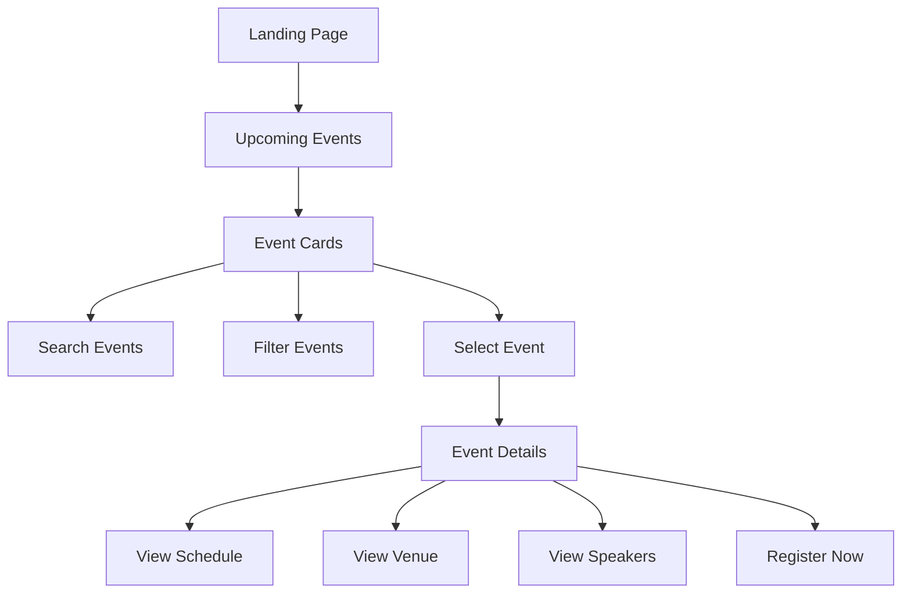

**Implementation notes:**
- Landing page surfaces featured and upcoming events.
- Event listing supports search (title, keyword) and filters (date, category, venue).
- Event details page is publicly accessible; "Register Now" routes into the Authentication flow.

---

### 2. Authentication Flow

**Audience:** Visitors becoming authenticated users

**Screens:** Login · Registration · Forgot Password · Dashboard Entry

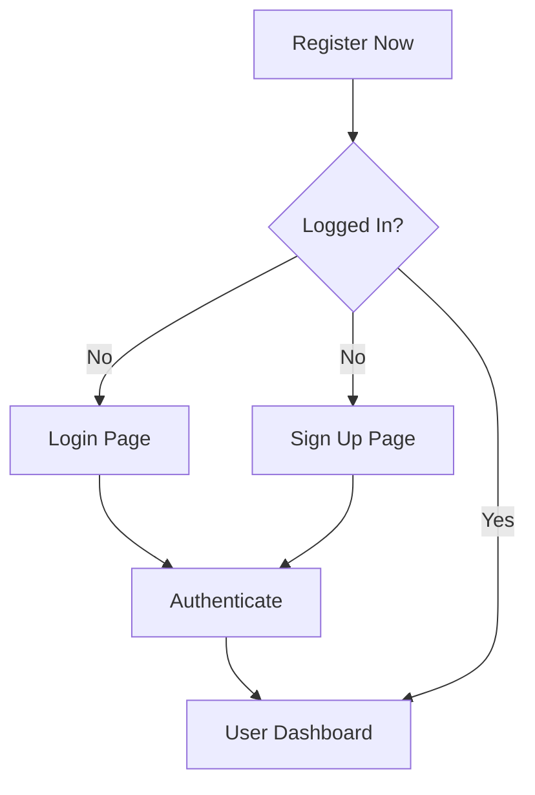

**Implementation notes:**
- "Register Now" from event details checks session state first.
- Login and Sign Up both converge on authentication, then redirect to User Dashboard (or back to the event registration flow).
- Forgot Password supports email-based reset.

---

### 3. User Dashboard Flow

**Audience:** Authenticated users

**Screens:** Dashboard · Profile · My Events · Notifications

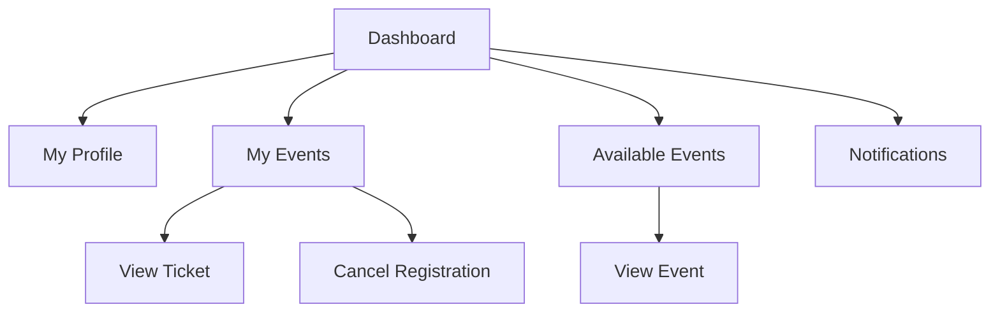

**Implementation notes:**
- Dashboard is the central hub after login.
- My Events shows registrations with ticket access (once Sprint 2 is complete).
- Available Events reuses the public listing with authenticated context.
- Notifications surface registration confirmations, waitlist updates, and event changes.

---

### 4. Event Registration Flow

**Audience:** Authenticated users registering for an event

**Features:** Registration · Eligibility checks · Waitlist

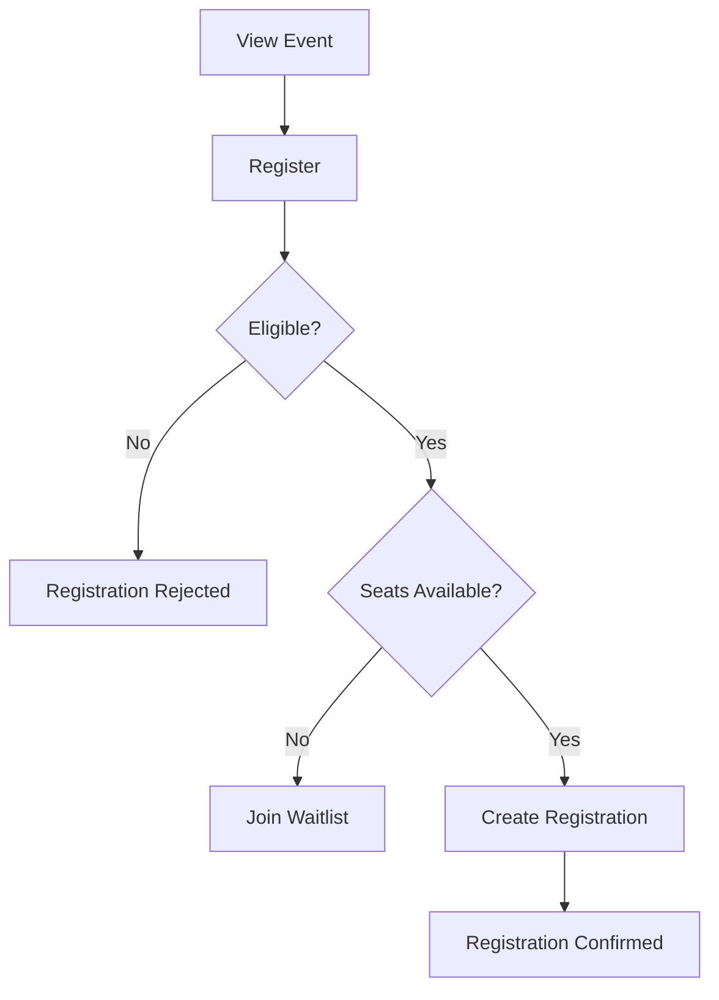

**Implementation notes:**
- Eligibility rules may include capacity limits, registration windows, user role, or prerequisite conditions.
- When capacity is full, user joins a waitlist (FIFO promotion when seats open).
- Confirmed registration proceeds to Seating (Sprint 2) if applicable, otherwise directly to ticket generation.

---

### 5. Seating Flow

**Audience:** Users with confirmed registrations at seated events

**Features:** Venue Layout · Seat Map · Seat Selection

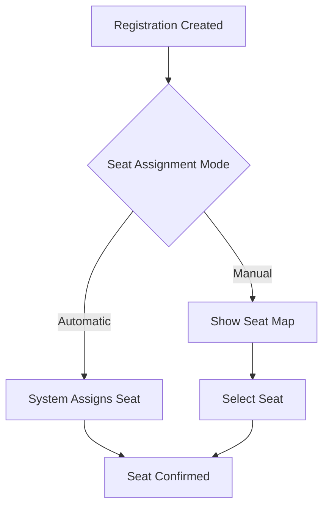

**Implementation notes:**
- Admin configures seat assignment mode per event (automatic vs. manual).
- Seat map reflects real-time availability (locked during selection).
- Seat confirmation triggers Ticket Generation flow.

---

### 6. Ticket Generation Flow

**Audience:** Registered attendees after seat confirmation (or direct registration for non-seated events)

**Features:** QR Code · PDF Ticket · Email Delivery

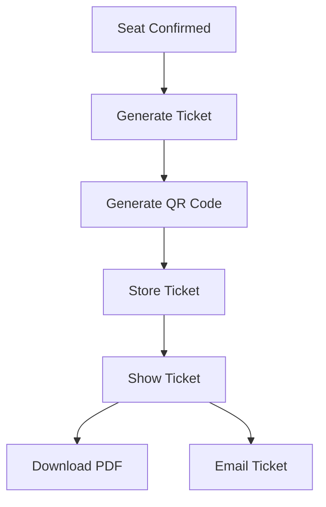

**Implementation notes:**
- Each ticket has a unique ID encoded in the QR code.
- PDF includes event details, attendee name, seat (if any), and QR code.
- Ticket stored in database and accessible from My Events → View Ticket.

---

### 7. Event Check-In Flow

**Audience:** Event staff

**Features:** QR Scanner · Attendance Tracking

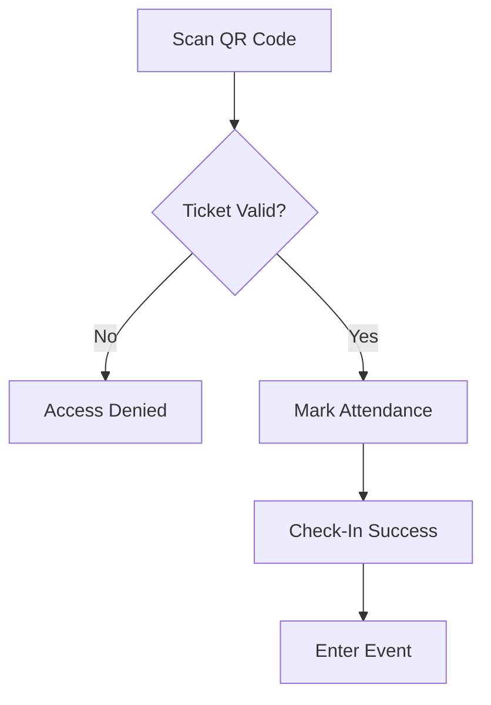

**Implementation notes:**
- Staff interface (web or mobile) scans QR codes.
- Validation checks: ticket exists, not already used, correct event, not cancelled.
- Attendance record timestamped for reporting (Sprint 4).

---

### 8. Admin Event Management Flow

**Audience:** Organizers / administrators

**Features:** Event Creation · Event Publishing · Event Updates

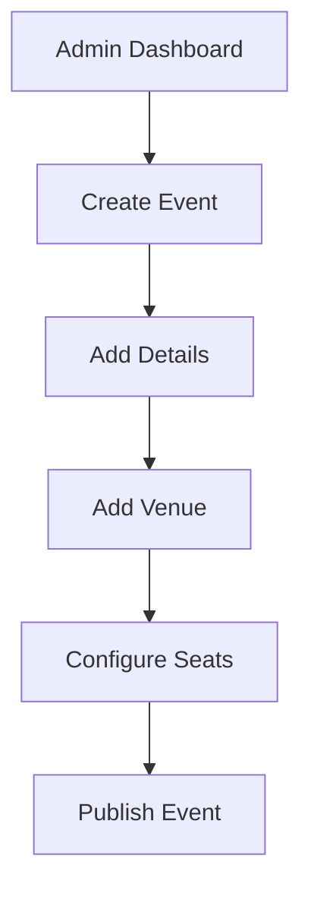

**Implementation notes:**
- Events progress through draft → published states.
- Venue and seat configuration link to Seating module.
- Published events appear in Public Event Discovery.

---

### 9. Registration Management Flow

**Audience:** Administrators

**Features:** Registration Approval · Attendee Management · Export Excel/PDF

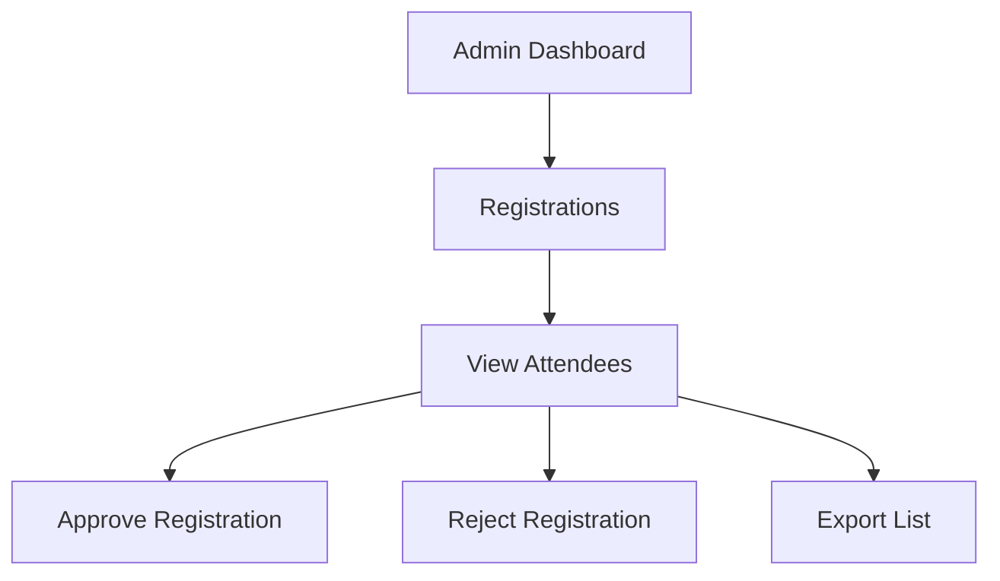

**Implementation notes:**
- Some events may require manual approval before confirmation.
- Approve/reject triggers notifications to attendees.
- Export supports Excel and PDF formats for offline use.

---

### 10. Reporting Flow

**Audience:** Administrators

**Features:** Registration Reports · Attendance Reports · Seat Occupancy · Event Analytics · Export

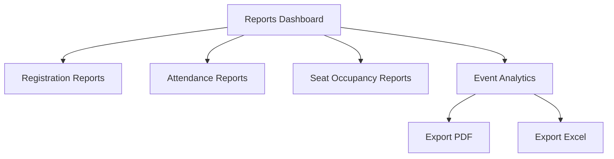

**Implementation notes:**
- Reports filterable by event, date range, and status.
- Seat occupancy derived from seating and check-in data.
- Analytics include registration trends, no-show rates, and capacity utilization.

---

## Development Roadmap (4 Sprints)

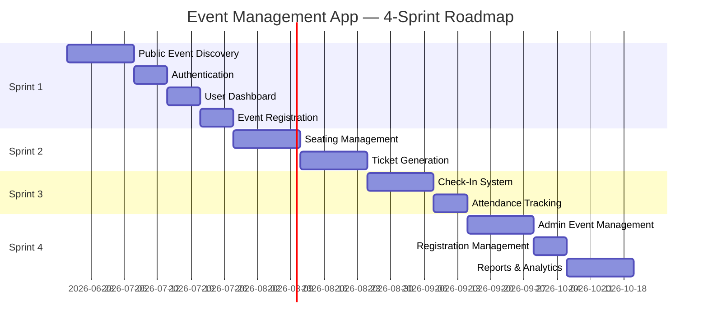

| Sprint | Phase | Modules | Outcome |
|--------|-------|---------|---------|
| **Sprint 1** | Phase 1 — MVP | 1, 2, 3, 4 | Users can discover events, sign up, and register |
| **Sprint 2** | Phase 2 | 5, 6 | Seated events, digital tickets with QR/PDF/email |
| **Sprint 3** | Phase 3 | 7 | Staff can check in attendees via QR scan |
| **Sprint 4** | Phase 4 | 8, 9, 10 | Full admin tooling and analytics |

---

## Sprint 1 — MVP: Public Discovery, Auth & Registration

**Duration:** ~5 weeks  
**Phase:** 1 (MVP)  
**Modules:** Public Event Discovery · Authentication · User Dashboard · Event Registration

### Objectives

Deliver a working end-to-end path: a visitor discovers an event, creates an account, and completes registration (with waitlist support).

### Tasks

#### Module 1 — Public Event Discovery

| Task | Description | Priority |
|------|-------------|----------|
| 1.1 | Design and implement Landing Page with featured/upcoming events | High |
| 1.2 | Build Event Listing page with event cards | High |
| 1.3 | Implement search (title, keyword) | High |
| 1.4 | Implement filters (date, category, venue) | Medium |
| 1.5 | Build Event Details page (schedule, venue, speakers) | High |
| 1.6 | Add "Register Now" CTA routing to auth/registration | High |
| 1.7 | Seed database with sample events for development | Medium |

#### Module 2 — Authentication

| Task | Description | Priority |
|------|-------------|----------|
| 2.1 | Implement user registration (Sign Up) | High |
| 2.2 | Implement login with session/JWT | High |
| 2.3 | Implement logout | High |
| 2.4 | Build Forgot Password flow (email reset) | Medium |
| 2.5 | Add auth guard: redirect unauthenticated users from protected routes | High |
| 2.6 | Post-login redirect (dashboard or return-to-event) | High |

#### Module 3 — User Dashboard

| Task | Description | Priority |
|------|-------------|----------|
| 3.1 | Build Dashboard layout with navigation | High |
| 3.2 | Implement My Profile (view/edit name, email, password) | High |
| 3.3 | Build My Events list (registrations) | High |
| 3.4 | Build Available Events section (reuse listing) | Medium |
| 3.5 | Implement Notifications panel (basic in-app) | Medium |
| 3.6 | Add Cancel Registration action | High |

#### Module 4 — Event Registration

| Task | Description | Priority |
|------|-------------|----------|
| 4.1 | Build registration form / one-click register | High |
| 4.2 | Implement eligibility checks (capacity, date window, user state) | High |
| 4.3 | Implement seat/capacity availability check | High |
| 4.4 | Build waitlist join flow when full | High |
| 4.5 | Registration confirmed / rejected UI states | High |
| 4.6 | API endpoints: create, cancel, list registrations | High |
| 4.7 | Waitlist promotion logic (on cancellation) | Medium |

### Sprint 1 — Data Models

```
User          → id, email, password_hash, name, role, created_at
Event         → id, title, description, date, venue_id, capacity, status, ...
Venue         → id, name, address, ...
Speaker       → id, name, bio, event_id (or M2M)
Registration  → id, user_id, event_id, status, waitlist_position, created_at
Notification  → id, user_id, message, read, created_at
```

### Sprint 1 — API Endpoints (Draft)

| Method | Endpoint | Description |
|--------|----------|-------------|
| GET | `/api/events` | List public events (search/filter) |
| GET | `/api/events/:id` | Event details |
| POST | `/api/auth/register` | Sign up |
| POST | `/api/auth/login` | Login |
| POST | `/api/auth/forgot-password` | Request reset |
| GET | `/api/users/me` | Current user profile |
| PUT | `/api/users/me` | Update profile |
| POST | `/api/registrations` | Register for event |
| DELETE | `/api/registrations/:id` | Cancel registration |
| GET | `/api/users/me/registrations` | My events |
| GET | `/api/users/me/notifications` | Notifications |

### Sprint 1 — Acceptance Criteria

- [ ] Visitor can browse events without logging in
- [ ] Visitor can search and filter events
- [ ] Visitor can view full event details
- [ ] User can register, login, and logout
- [ ] Authenticated user sees dashboard with profile and my events
- [ ] User can register for an available event and see confirmation
- [ ] User is waitlisted when event is full
- [ ] User can cancel a registration
- [ ] Waitlisted user is promoted when a seat opens

### Sprint 1 — End-to-End Flow

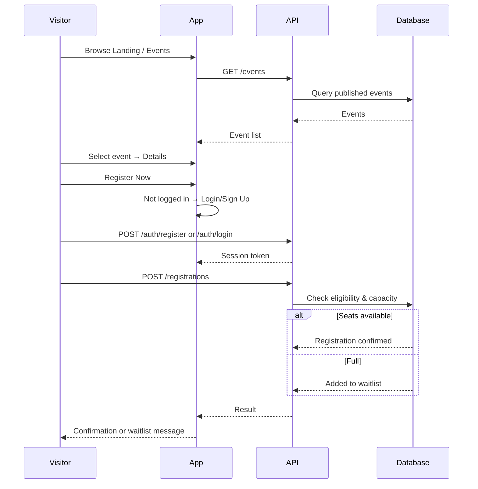

---

## Sprint 2 — Seating & Ticketing

**Duration:** ~4 weeks  
**Phase:** 2  
**Modules:** Seating Management · Ticket Generation

### Objectives

Support venue-based events with seat maps, automatic or manual seat assignment, and digital ticket delivery.

### Tasks

#### Module 5 — Seating Management

| Task | Description | Priority |
|------|-------------|----------|
| 5.1 | Design venue layout data model (sections, rows, seats) | High |
| 5.2 | Build admin seat configuration UI (or API for Sprint 4 UI) | High |
| 5.3 | Implement automatic seat assignment algorithm | High |
| 5.4 | Build interactive seat map component | High |
| 5.5 | Implement manual seat selection with real-time lock | High |
| 5.6 | Seat hold timeout (release if user abandons) | Medium |
| 5.7 | Seat confirmed state linked to registration | High |

#### Module 6 — Ticket Generation

| Task | Description | Priority |
|------|-------------|----------|
| 6.1 | Generate unique ticket ID per registration | High |
| 6.2 | Generate QR code encoding ticket ID + event ID | High |
| 6.3 | Store ticket record in database | High |
| 6.4 | Build View Ticket screen (My Events → View Ticket) | High |
| 6.5 | Implement PDF ticket generation (event info, QR, seat) | High |
| 6.6 | Implement Download PDF action | High |
| 6.7 | Implement email ticket delivery (SMTP/integration) | High |
| 6.8 | Resend ticket email from dashboard | Low |

### Sprint 2 — Data Models (Additions)

```
VenueLayout   → id, venue_id, sections_json
Seat          → id, venue_id, section, row, number, status
SeatAssignment → id, registration_id, seat_id, mode (auto/manual)
Ticket        → id, registration_id, qr_payload, pdf_url, issued_at
```

### Sprint 2 — API Endpoints (Additions)

| Method | Endpoint | Description |
|--------|----------|-------------|
| GET | `/api/events/:id/seats` | Seat map with availability |
| POST | `/api/registrations/:id/seat/auto` | Auto-assign seat |
| POST | `/api/registrations/:id/seat/select` | Manual seat selection |
| GET | `/api/tickets/:id` | Get ticket details |
| GET | `/api/tickets/:id/pdf` | Download PDF |
| POST | `/api/tickets/:id/email` | Email ticket |

### Sprint 2 — Acceptance Criteria

- [ ] Seated events show seat map after registration
- [ ] Automatic assignment picks an available seat
- [ ] Manual selection lets user pick and confirm a seat
- [ ] Seat cannot be double-booked
- [ ] Ticket generated with unique QR code after seat confirmation
- [ ] User can view ticket in dashboard
- [ ] User can download PDF ticket
- [ ] User receives ticket via email

### Sprint 2 — End-to-End Flow

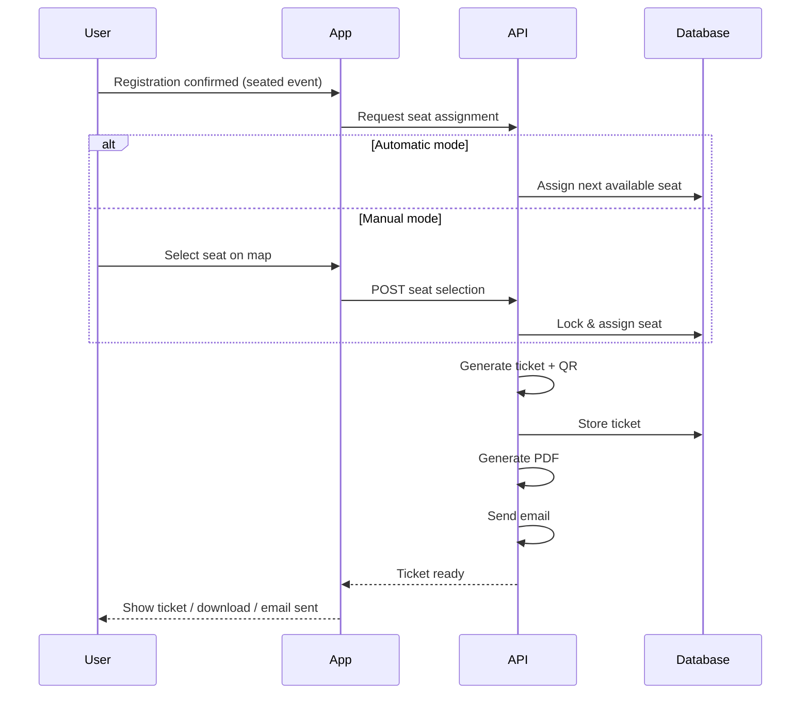

---

## Sprint 3 — Check-In & Attendance

**Duration:** ~3 weeks  
**Phase:** 3  
**Modules:** Event Check-In

### Objectives

Enable event staff to scan QR codes, validate tickets, and record attendance in real time.

### Tasks

#### Module 7 — Event Check-In

| Task | Description | Priority |
|------|-------------|----------|
| 7.1 | Build staff check-in interface (web, mobile-friendly) | High |
| 7.2 | Integrate QR code scanner (camera / manual entry fallback) | High |
| 7.3 | Implement ticket validation logic | High |
| 7.4 | Mark attendance with timestamp and staff ID | High |
| 7.5 | Handle invalid/expired/already-used tickets | High |
| 7.6 | Real-time check-in count on staff dashboard | Medium |
| 7.7 | Role-based access: staff vs. admin | High |
| 7.8 | Offline scan queue (optional, low priority) | Low |

### Sprint 3 — Data Models (Additions)

```
Attendance    → id, ticket_id, event_id, checked_in_at, checked_in_by, status
StaffAssignment → id, user_id, event_id, role
```

### Sprint 3 — API Endpoints (Additions)

| Method | Endpoint | Description |
|--------|----------|-------------|
| POST | `/api/check-in/scan` | Validate QR and check in |
| GET | `/api/events/:id/attendance` | Attendance list (staff) |
| GET | `/api/events/:id/check-in-stats` | Live stats |

### Sprint 3 — Ticket Validation Rules

| Condition | Result |
|-----------|--------|
| Ticket not found | Access Denied |
| Ticket for wrong event | Access Denied |
| Registration cancelled | Access Denied |
| Already checked in | Access Denied (or show duplicate warning) |
| Valid, first scan | Check-In Success |

### Sprint 3 — Acceptance Criteria

- [ ] Staff can open check-in interface for assigned event
- [ ] QR scan validates ticket in under 2 seconds
- [ ] Valid ticket shows success and marks attendance
- [ ] Invalid/used ticket shows clear denial message
- [ ] Attendance records visible to admin (feeds Sprint 4 reports)
- [ ] Check-in count updates in real time

### Sprint 3 — End-to-End Flow

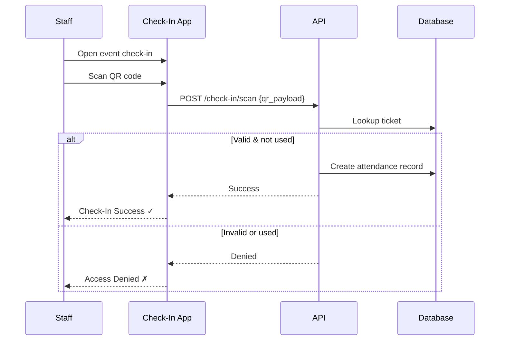

---

## Sprint 4 — Admin Management & Reporting

**Duration:** ~5 weeks  
**Phase:** 4  
**Modules:** Admin Event Management · Registration Management · Reporting & Analytics

### Objectives

Give organizers full control over event lifecycle, registration approval, attendee exports, and analytics dashboards.

### Tasks

#### Module 8 — Admin Event Management

| Task | Description | Priority |
|------|-------------|----------|
| 8.1 | Build Admin Dashboard shell | High |
| 8.2 | Create Event wizard (details, schedule, speakers) | High |
| 8.3 | Venue management (create/edit venues) | High |
| 8.4 | Seat configuration UI (layout builder) | High |
| 8.5 | Event draft / publish / unpublish workflow | High |
| 8.6 | Edit published events (with attendee notification) | Medium |
| 8.7 | Delete/archive events | Medium |

#### Module 9 — Registration Management

| Task | Description | Priority |
|------|-------------|----------|
| 9.1 | Registrations list per event | High |
| 9.2 | View attendee details | High |
| 9.3 | Approve registration (for approval-required events) | High |
| 9.4 | Reject registration with reason | High |
| 9.5 | Export attendee list to Excel | High |
| 9.6 | Export attendee list to PDF | Medium |
| 9.7 | Bulk actions (approve/reject/export) | Medium |
| 9.8 | Manual waitlist promotion override | Low |

#### Module 10 — Reporting & Analytics

| Task | Description | Priority |
|------|-------------|----------|
| 10.1 | Reports Dashboard layout | High |
| 10.2 | Registration reports (by event, status, date) | High |
| 10.3 | Attendance reports (check-in vs. registered) | High |
| 10.4 | Seat occupancy reports | Medium |
| 10.5 | Event analytics (trends, capacity utilization) | Medium |
| 10.6 | Export reports to PDF | High |
| 10.7 | Export reports to Excel | High |
| 10.8 | Date range and event filters on all reports | High |

### Sprint 4 — Data Models (Additions)

```
Event         → add: requires_approval, published_at, created_by
Registration  → add: approved_by, approved_at, rejection_reason
ReportSnapshot → id, event_id, type, generated_at, file_url (optional cache)
```

### Sprint 4 — API Endpoints (Additions)

| Method | Endpoint | Description |
|--------|----------|-------------|
| POST | `/api/admin/events` | Create event |
| PUT | `/api/admin/events/:id` | Update event |
| POST | `/api/admin/events/:id/publish` | Publish event |
| GET | `/api/admin/events/:id/registrations` | List registrations |
| POST | `/api/admin/registrations/:id/approve` | Approve |
| POST | `/api/admin/registrations/:id/reject` | Reject |
| GET | `/api/admin/events/:id/registrations/export` | Export Excel/PDF |
| GET | `/api/admin/reports/registrations` | Registration report |
| GET | `/api/admin/reports/attendance` | Attendance report |
| GET | `/api/admin/reports/seat-occupancy` | Seat occupancy |
| GET | `/api/admin/reports/analytics` | Event analytics |
| GET | `/api/admin/reports/export` | Export report PDF/Excel |

### Sprint 4 — Acceptance Criteria

- [ ] Admin can create, edit, and publish events
- [ ] Admin can configure venue and seats
- [ ] Published events appear in public discovery
- [ ] Admin can view and manage all registrations per event
- [ ] Admin can approve/reject registrations
- [ ] Admin can export attendee lists (Excel/PDF)
- [ ] Reports dashboard shows registration, attendance, and occupancy data
- [ ] Reports exportable to PDF and Excel

### Sprint 4 — End-to-End Flow

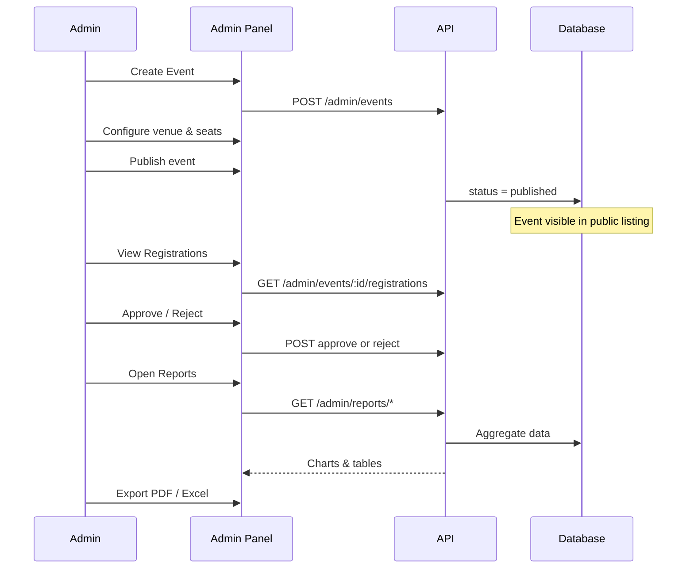

---

## Cross-Cutting Concerns

Apply across all sprints:

| Concern | Approach |
|---------|----------|
| **Security** | HTTPS, password hashing (bcrypt/argon2), JWT/session expiry, RBAC (visitor, attendee, staff, admin) |
| **Validation** | Server-side validation on all inputs; client-side for UX |
| **Error handling** | Consistent API error format; user-friendly messages |
| **Logging** | Request logs, auth events, check-in audit trail |
| **Testing** | Unit tests for business logic; integration tests for API; E2E for critical flows |
| **Responsive UI** | Mobile-first; check-in and ticket views optimized for phones |
| **Accessibility** | WCAG 2.1 AA targets for public and dashboard pages |
| **Notifications** | In-app + email for registration, waitlist, ticket, approval events |
| **Database** | Relational DB (PostgreSQL recommended); migrations from Sprint 1 |
| **CI/CD** | Lint, test, build pipeline; staging deploy per sprint |

### Role-Based Access Matrix

| Feature | Visitor | Attendee | Staff | Admin |
|---------|---------|----------|-------|-------|
| Browse events | ✓ | ✓ | ✓ | ✓ |
| Register for event | | ✓ | | ✓ |
| User dashboard | | ✓ | ✓ | ✓ |
| View own ticket | | ✓ | | ✓ |
| Check-in scan | | | ✓ | ✓ |
| Create/manage events | | | | ✓ |
| Manage registrations | | | | ✓ |
| View reports | | | | ✓ |

---

## Suggested Tech Stack

| Layer | Recommendation | Notes |
|-------|----------------|-------|
| **Frontend** | React / Next.js or Vue / Nuxt | Component-based; SSR for SEO on public pages |
| **Backend** | Node.js (Express/Fastify) or Python (FastAPI/Django) | REST API; consider GraphQL later |
| **Database** | PostgreSQL | Events, registrations, seats, tickets |
| **Auth** | JWT + refresh tokens or session cookies | Role claims in token |
| **QR Codes** | `qrcode` library (gen); `html5-qrcode` or ZXing (scan) | |
| **PDF** | Puppeteer, jsPDF, or ReportLab | Ticket and report PDFs |
| **Email** | SendGrid, AWS SES, or SMTP | Transactional emails |
| **File storage** | S3 / local storage | PDF tickets, exports |
| **Excel export** | ExcelJS or openpyxl | Attendee and report exports |
| **Deployment** | Docker + cloud (AWS, Azure, Railway) | |

---

## Deliverables Summary

### Sprint 1 Deliverables
- Public website: landing, listing, search/filter, event details
- Auth: login, sign up, forgot password
- User dashboard: profile, my events, notifications
- Registration API with eligibility and waitlist
- Database schema v1 + seed data

### Sprint 2 Deliverables
- Venue seat map and assignment (auto + manual)
- Ticket entity with QR code
- PDF ticket download
- Email ticket delivery
- View Ticket in user dashboard

### Sprint 3 Deliverables
- Staff check-in web app with QR scanner
- Ticket validation engine
- Attendance records and live stats
- Staff role and event assignment

### Sprint 4 Deliverables
- Admin dashboard
- Event CRUD with publish workflow
- Venue and seat configuration UI
- Registration approval and management
- Attendee export (Excel/PDF)
- Reports dashboard with analytics
- Report export (PDF/Excel)

---

## Full System Flow (All Modules)

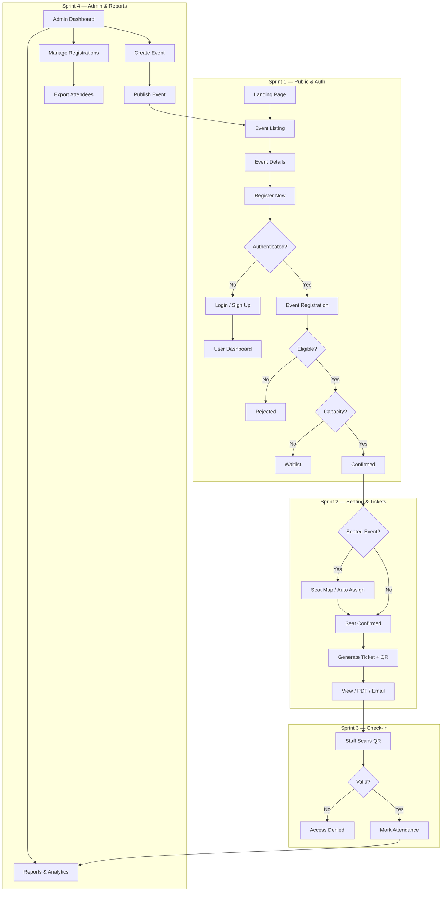

---

*Document version: 1.0 · Created for Event Management App UCA · Last updated: June 2026*
